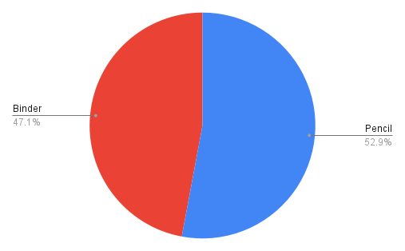
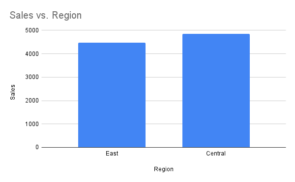
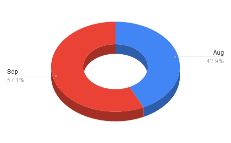
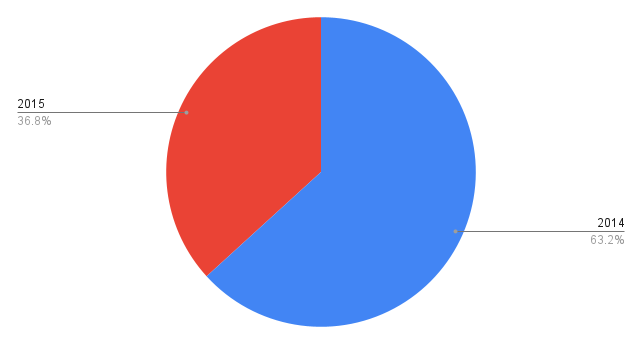

# SkilHarvest-Assignment1

I did an exploratory data analysis (EDA) on the stationaries supply of the SkilHarvest company to find various trends and insight for making informed decisions

**Documentation Outline**

-[Project Overview](#project-overview)

-[Data Source](#data-source)

-[Tools used](#tools-used)

-[Data Cleaning and Preparation](#data-cleaning-and-preparation)

-[Data Analysis](#data-analysis)

-[Tables containing Analysis](#tables-containing-analysis)

-[Results/Findings](#results-findings)

## Project Overview
---
This data analysis project aims to examine the sales performance of SkilHarvest's E-commerce spanning two years. By performing various queries within the data, I intend to uncover patterns and trends that will help in crafting compelling narratives around the sales data. Ultimately, this analysis seeks to identify the key drivers of success and pinpoint areas for improvement within SkilHarvest's E-commerce operations, thereby optimizing our overall performance.

## Data Source
---
The primary source used in this EDA is SkilHarvest_Stationary_Supply.csv. The data was provided by the SkilHarvest company

## Tools Used
---
Microsoft Excel to collect, clean, and transform data
Google Sheets (For querying and analyzing the data)

## Data Cleaning and Preparation
---
EDA involved exploring the data to answer some questions about the data such as:

1.	The Sales Rep whose Items are Pen Set and Binders 
2.	Show sales of binder items and pencils in 2015 
3.	Sales in Central and East regions in 2014 
4.	Sales in August and September 2014
5.	Show sales of items that start with 'Pen', including their region, sales rep, and year
6.	Show sales of items that end with ‘sk’, including their region, sales rep, and year

## Data Analysis
```
Google Sheet

1. =QUERY(A:H, "SELECT B,C WHERE (C='Pen Set' OR C='Binder')", 1)
2. =QUERY(A:H, "SELECT C,F,H WHERE (C='Binder' OR C='Pencil') AND F=2015", 1)
3. =QUERY(A:H, "SELECT H, A, F WHERE (A='Central' OR A='East') and F = 2014", 1)
4. =QUERY(A:H, "SELECT E, F, H WHERE F=2014 AND (E='Aug' OR E='Sep')", 1)
5. =QUERY(A:H, "SELECT A,B,C,F,H WHERE C LIKE 'Pen%'", 1)
6. =QUERY(A:H, "SELECT A,B,C,F,H WHERE C LIKE '%sk'", 1)
```

## Tables containing Analysis
---

**1. The Sales Rep whose Items are Pen Set and Binders**
|Sales_rep |Item |
|-----|-----|
|Richard|Pen Set |
|Nick|Binder|
|Morgan|Pen Set|
|Susan|Binder|
|Matthew|Pen Set|
|Richard|Pen Set|
|Morgan|Binder|
|Thomas|Binder|
|Alex|Binder|
|Matthew|Pen Set|
|Alex|Binder|
|Rachel|Binder|
|Susan|Pen Set|
|Bill|Binder|
|Matthew|Binder|
|Smith|Binder|
|Richard|Binder|
|James|Binder|
|Alex|Pen Set|
|Richard|Binder|
|Bill|Binder|
|Richard|Binder|


**2.	Show sales of binder items and pencils in 2015**
|Item |Year |Sales|  
|-----|-----|-----|
|Pencil|2015 |189.05|
|Binder|2015|413.54|
|Binder|2015|999.5|
|Binder|2015|1305|
|Pencil|2015|179.64|
|Binder|2015|19.96|
|Binder|2015|139.93|
|Pencil|2015|167.44|
|Binder|2015|299.4|
|Pencil|2015|131.34|
|Pencil|2015|149.25|
|Pencil|2015|449.1|
|Pencil|2015|68.37|
|Pencil|2015|63.69|
|Binder|2015|719.2|
|Binder|2015|539.4|
|Pencil|2015|449.1|


**3.	Sales in Central and East regions in 2014**
|Sales       |Region   |Year    |  
|-----      |-----    |-----    |
|309.38|East |2014|
|57.71|East|2014|
|686.95|Central|2014|
|1619.19|East|2014|
|1005.9|Central|2014|
|174.65|East|2014|
|250|Central|2014|
|9.03|Central|2014|
|255.84|East|2014|
|251.72|Central|2014|
|575.36|East|2014|
|18.06|Central|2014|
|299.85|East|2014|
|54.89|Central|2014|
|479.04|Central|2014|
|1879.06|Central|2014|
|86.43|Central|2014|
|139.72|Central|2014|
|1183.26|East|2014|


**4.	Sales in August and September 2014**
|Month       |Year     |Sales    |  
|-----      |-----    |-----    |
|Aug|2014|1005.9|
|Aug|2014|174.65|
|Aug|2014|825|
|Sep|2014|250|
|Sep|2014|9.03|
|Sep|2014|255.84|
|Sep|2014|155.24|


**5.	Show sales of items that start with 'Pen', including their region, sales rep, and year**
|Region    |Sales_rep   |Item        |Year    |Sales   |
|-----     |-----       |-----       |-----   |-----   |
|East      |Richard     |Pen Set     |2014    |309.38  |
|Central   |Morgan      |Pan Set     |2014    |86.95   |
|Central   |Matthew     |Pen Set     |2014    |1005.9  |
|East      |Richard     |Pencil      |2014    |174.65  |
|Central   |Bill        |Pencil      |2014    |9.03    |
|East      |Richard     |Pen Set     |2014    |255.84  |
|West      |James       |Pen         |2014    |151.24  |
|East      |Richard     |Pen         |2014    |575.36  |
|Central   |Rachel      |Pencil      |2014    |18.06   |
|East      |Susan       |Pen         |2014    |299.85  |
|Central   |Matthew     |Pen Set     |2014    |479.04  |
|Central   |Smith       |Pencil      |2014    |86.43   |
|East      |Susan       |Pen Set     |2014    |1183.26 |
|East      |Richard     |Pencil      |2015    |189.05  |
|Central   |Alex        |Pencil      |2015    |179.64  |
|Central   |Bill        |Pen         |2015    |539.73  |
|West      |James       |Pencil      |2015    |167.44  |
|Central   |Alex        |Pen Set     |2015    |249.5   |
|Central   |Rachel      |Pencil      |2015    |131.34  |
|Central   |Rachel      |Pencil      |2015    |149.25  |
|East      |Nick        |Pen         |2015    |479.04  |
|Central   |Alex        |Pencil      |2015    |449.1   |
|Central   |Bill        |Pencil      |2015    |68.37   |
|West      |Thomas      |Pencil      |2015    |63.68   |
|Central   |Morgan      |Pencil      |2015    |449.1   |


**6.	Show sales of items that end with ‘sk’, including their region, sales rep, and year**
|Region    |Sales_rep   |Item        |Year    |Sales   |
|-----     |-----       |-----       |-----   |-----   |
|West      |James     |Desk    |2014    |825 |
|Central   |Smith     |Desk     |2014    |250   |
|Central   |Matthew     |Desk     |2015    |625  |


## Data Visualization
---
The following visualizations were generated in Google Sheets using the queries in *Tables Containing Queries* above

1. The aggregate sales of Pencil and Binder in 2015



2. Which region had the most sales in 2014?



3. Which month had the highest sales in 2015?



4. Total Sales of desk items in year 2014 in 2015




## Results/Findings
---
1. Pencil items had the highest sales in 2014 with a total of 53%

2. The Central region had the highest sales in the year 2014.

3. Between Aug and Sep 2014, Sep had the highest sales.

4. Desk items were sold more in 2014 than in 2015.
